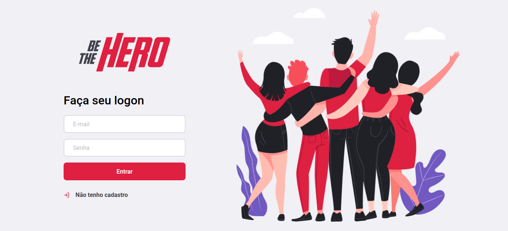
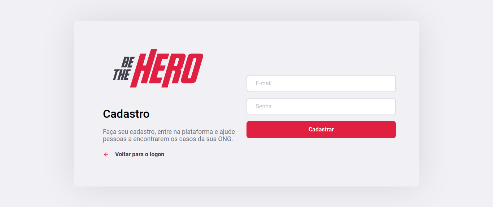
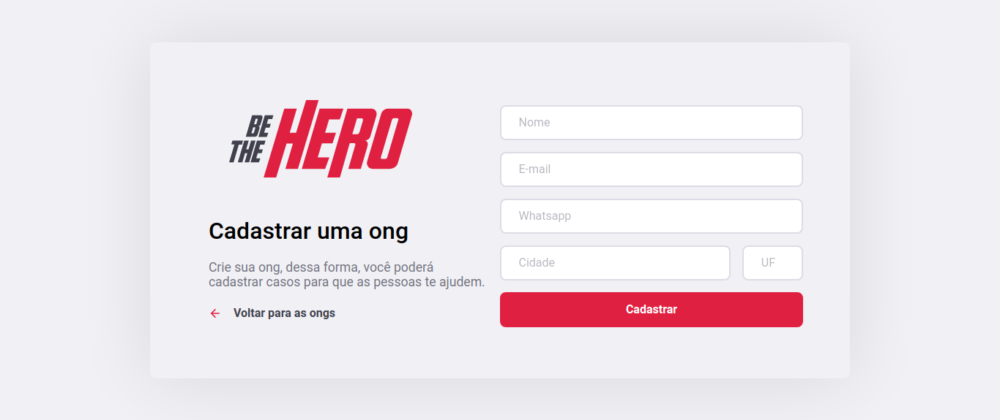
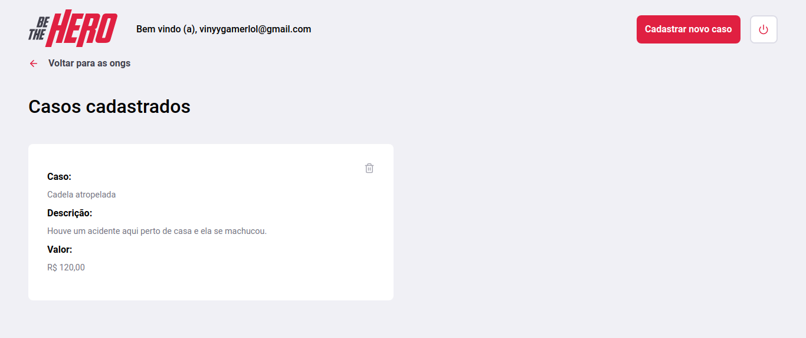
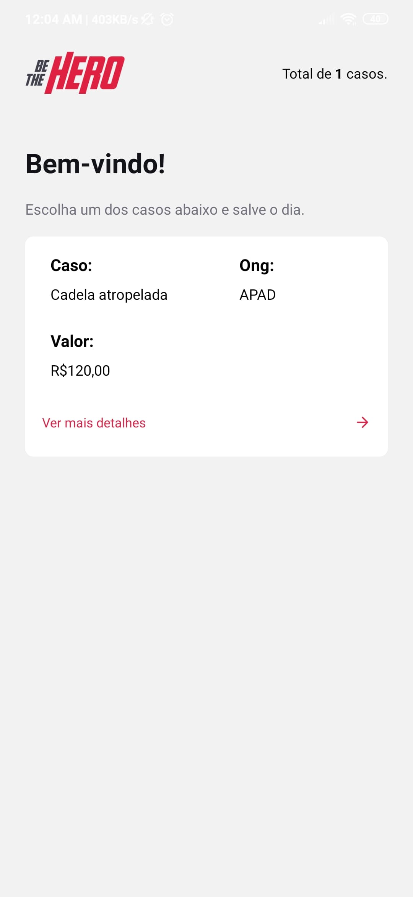
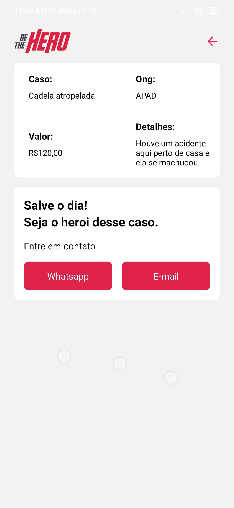
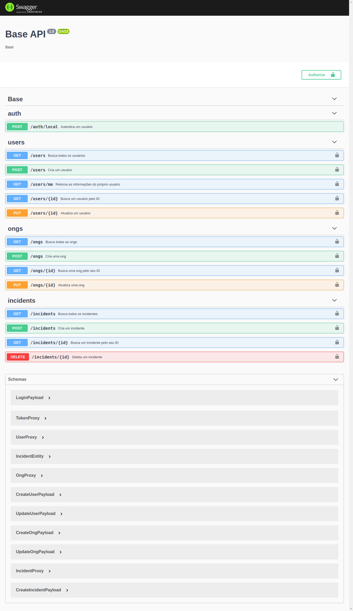

<h1 align="center">
    
</h1>

<h4 align="center">
  🚀 Semana OmniStack 11.0
</h4>

  <a href="#book-projeto">Projeto</a>&nbsp;&nbsp;&nbsp;|&nbsp;&nbsp;&nbsp;
  <a href="#rocket-tecnologias">Tecnologias</a>&nbsp;&nbsp;&nbsp;|&nbsp;&nbsp;&nbsp;
  <a href="#collision-diferenciais">Diferenciais</a>&nbsp;&nbsp;&nbsp;|&nbsp;&nbsp;&nbsp;
  <a href="#camera-imagens">Imagens</a>

## :book: Projeto

Be The Hero, seja o herói para quem precisa da sua ajuda!

O projeto foi pensado pelo time da :rocket: [Rocketseat](https://github.com/Rocketseat) para ajudar ONGs, dessa forma, cada ONG pode criar casos usando a aplicação web para possa ser divulgado para as pessoas. 

Após criar um caso, as pessoas poderão usar o aplicativo para encontrar esses casos e serem os heróis para essa ONG.

## :rocket: Tecnologias

Esse projeto foi desenvolvido com as seguintes tecnologias:

- Backend
    - [NestJS](https://nestjs.com/)
    - [Node.js](https://nodejs.org/en/)
- Frontend
    - [React](https://reactjs.org)
- Mobile
    - [React Native](https://facebook.github.io/react-native/)
    - [Expo](https://expo.io/)
    - [Ionic](https://ionicframework.com/)
    - [Angular](https://angular.io/)

## :collision: Diferenciais

Para o `mobile`, eu quis fazer uma comparação, então eu fiz em dois frameworks: React Native e em Ionic. 

Para acessar cada projeto, veja [essa pasta](./mobile-ionic) para o Ionic, e [essa pasta](./mobile-react-native) para o React Native.

No `backend`, eu alterei um poucos as entidades para que suportassem autenticação JWT, assim como, a possibilidade de um usuário possuir várias ONGs, para saber mais, veja [o README](./backend-nestjs) do `backend`.

Por consequência das alterações do `backend`, foram adicionados novas páginas para o `frontend` como o cadastro de usuários, de ONGs e a listagem delas.

## :camera: Imagens

### Frontend

Imagens do Frontend

#### Login

#### Registrar usuário

#### Suas ongs

#### Criar uma ong

#### Casos de uma ong

#### Criar um novo caso

### Mobile

A seguir, as páginas do aplicativo mobile.

#### Listagem de casos

<h1 align="center">
    
</h1>

#### Detalhes um caso

<h1 align="center">
    
</h1>

### Backend

A seguir, a página do Swagger com todas as rotas da API documentadas.

