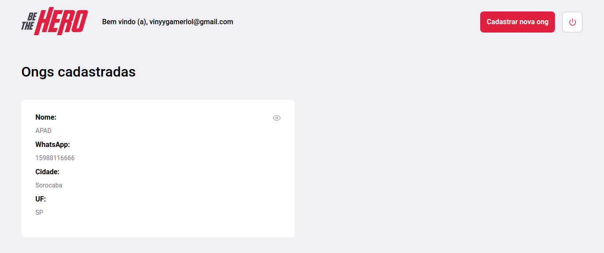

# Omnistack 11

Esse é o repositório que contém todos os projetos da semana OmniStack 11.

Sobre o repositório, eu irei utilizar NestJS em vez de Express para o backend mas irei também adicionar a implementação em Express. O motivo da escolha de utilizar NestJS é porque eu prefiro programar com TypeScript, e ele é um excelente framework para criação de APIs com Node e TypeScript.

## Entidades

A seguir, as entidades do banco de dados extraida a partir da primeira aula, eu irei modificar um pouco mas no geral é isso:

Usuário:
- Email
- Password ( não havia também, mas eu irei trabalhar com sistema de autenticação por senha )
- Roles ( não visto mas irei incluir por padrão )
- Ongs[] ( uma relação OneToMany )

Apesar das Ongs aparentemente serem um usuário de certa forma, eu ainda irei separar em uma entidade por sí só.

Ongs:
- Name
- Email
- Cidade
- UF
- Whatsapp
- Usuário ( uma relação ManyToOne )
- Casos[] ( uma relação OneToMany )

Incidentes:
- Título
- Descrição
- Valor
- Ong ( uma relação ManyToOne )

## Imagens

### Frontend

Imagens do Frontend

#### Login

#### Registrar usuário

#### Suas ongs

#### Criar uma ong

#### Casos de uma ong

#### Criar um novo caso

### Mobile

A seguir, as páginas do aplicativo mobile.

#### Listagem de casos

#### Detalhes um caso

### Backend

A seguir, a página do Swagger com todas as rotas da API documentadas.

